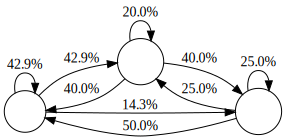

# Markov Chains with Scala



Exploring different concepts and playing around with [Markov Chains][mc] in Scala.

The code was also written as part of my exploration of [Twitch - @otobrglez](https://www.twitch.tv/otobrglez).

## Examples

### `gen1` - Pulling crypto-currencies and generating names

```bash
$ sbt "runMain com.pinkstack.gen1.SyncCurrenciesApp"
$ sbt "runMain com.pinkstack.gen1.GenerateNameApp"
```

### `gen2` - Clean and simple FP implementation

```bash
$ sbt "runMain com.pinkstack.gen1.Main"
```

## Resources

- https://en.wikipedia.org/wiki/Markov_chain
- https://brilliant.org/wiki/markov-chains/
- https://towardsdatascience.com/introduction-to-markov-chains-50da3645a50d

[mc]: https://en.wikipedia.org/wiki/Markov_chain

## Author

- [Oto Brglez](https://github.com/otobrglez) / [@otobrglez](https://twitter.com/otobrglez)
